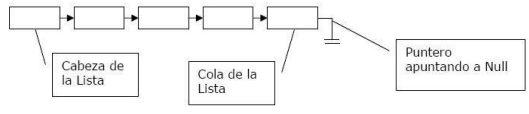

# Lista Enlazada

Una lista enlazada es una coleccion de elementos llamados nodos. cada nodo se compone en su forma mas sencilla de datos y una referencia al siguiente nodo de la lista.


Las listas enlazadas poseen dos elementos principales que las caracterizan: la cabeza y la cola los cuales son el primer y ultimo elemento de la lista, respectivamente.

En las listas de acuerdo a quién apunte su cabeza y cola y al tipo de nodo que implementa (cuántos
punteros tiene) se dividen en cuatro grandes tipos:

- Listas enlazadas (simplemente enlazadas)
- Listas doblemente enlazadas
- Listas circulares (simplemente circulares)
- Listas doblemente circulares

En el caso de las listas simplemente enlazadas la cabeza solo referencia al siguiente elemento que compone la lista, mientras que la cola referencia al valor `null`



## Insertar un nuevo elemento en la lista

### Agregar un nuevo elemento al final de la lista

Para este caso es necesario tomar en cuenta dos posibles escenarios: 

1. La lista esta vacia, por lo que el nodo que se inserta ahora es la cabeza y la cola de la lista.
2. La lista no esta vacia, por lo que se puede insertar el nuevo nodo al final de la, actualizando las referencias de la cola.
```
Add(value)
  pre: values is the value to add to the tail of the list
  post: value has been placed at the tail of the list
  n ← node(value)
  if head = ø
    head ← n
  	tail ← n 
  else 
    tail.next ← n
    tail ← n
	end if
end Add
```